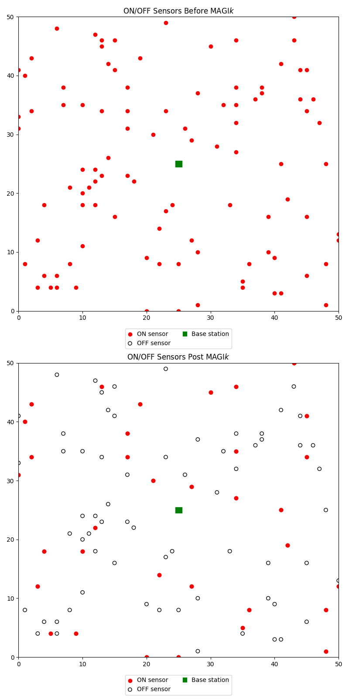
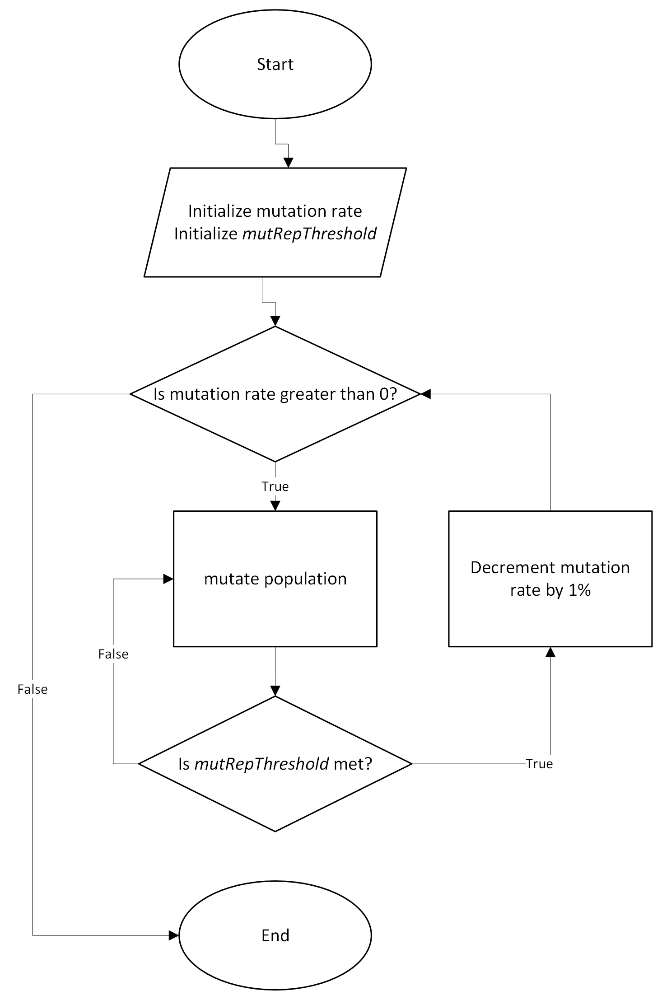
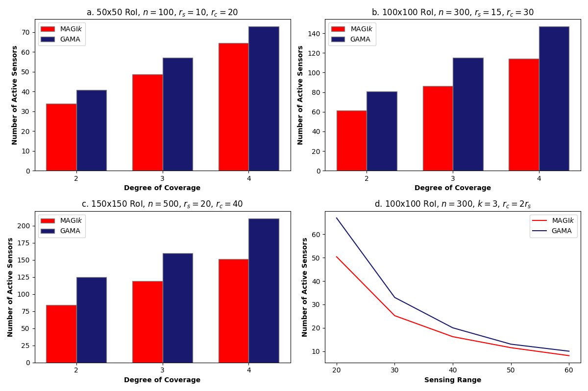
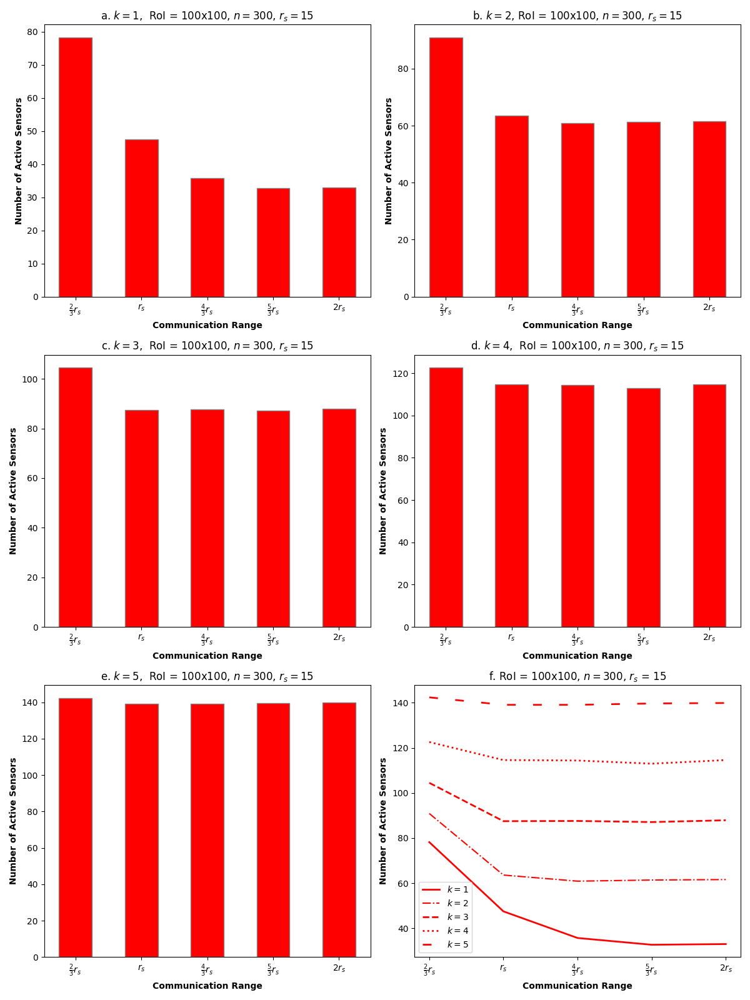

<p align="center">
  
</p>

<h1 align="center">MAGI<em>k</em></h1>

<p align="center">
  <strong>Minimizing Active Sensors using a modified Genetic Algorithm with Improved mutation for <em>k</em>-coverage and connectivity in wireless sensor networks.</strong>
</p>

<p align="center">
  
  
  
  
</p>

---

A Python implementation of **MAGI*k***, a modified genetic algorithm that finds the minimum number of active sensors needed to keep a randomly deployed wireless sensor network (WSN) *k*-covered and connected. Turning off redundant sensors saves energy and extends network lifetime.

The algorithm is centralized (runs at the base station) and differs from a traditional GA in two ways:

- **Extreme elitism** — the single best solution can be replaced *mid-generation*, so every later solution builds on the newest best rather than waiting for the generation to finish. Only the best solution is stored.
- **Dynamic mutation** — the mutation rate starts high (5%) and steps down by 1% every `mutRepThreshold` generations, so early solutions explore broadly and later ones make fine adjustments. Once *k*-coverage and connectivity are met, mutation biases toward turning sensors *off*.

MAGI*k* improves on GAMA (Zaidi et al.), reaching *k*-coverage and connectivity with fewer active sensors and a better runtime: **O(n² log n)** vs. GAMA's **O(n²√n)**.

---

## Authors

Kellen K. O'Rourke (Pomona College) and Habib M. Ammari (WiSeMAN Research Center, Texas A&M International University).

---

## How It Works

The problem: given a `w × h` region with `n` randomly placed static sensors (identical sensing range `rs` and communication range `rc`), select the fewest sensors to leave **ON** such that every point is covered by at least `k` sensors and all active sensors form a connected network.

Each candidate solution is scored by a weighted fitness function over three metrics:

| Metric | Meaning | Weight |
|:--|:--|:--|
| *k*-coverage rate | how close every point is to being covered by `k` sensors (capped at `k`) | 0.52 (highest) |
| Connectivity rate | fraction of active sensors reachable via DFS from the network | 0.47 |
| Inactivity rate | fraction of sensors turned OFF (only matters once the above are met) | 1.0, but only rewarded after coverage + connectivity hit 1.0 |

Solutions that fully achieve coverage or connectivity get a ×100 bonus on that metric, guaranteeing they always beat solutions that don't — even if the losing solution uses fewer sensors. Max possible score is 100 (never reached, since that would mean coverage with zero active sensors).

<p align="center">
  
</p>

---

## Project Structure

```
MAGIk/
|-- MAGIk.py          # Core: GA loop, mutation, fitness, connectivity (DFS)
|-- MAGIk_graphs.py   # Plots results (hardcoded run data) — MAGIk vs GAMA + comms-range sweeps
|-- README.md
```

| File | Contents |
|:--|:--|
| `MAGIk.py` | `Sensor` and `Environment` classes, `mutate_sensors`, `calculate_fitness`, `calculate_connectivity_score` (DFS), the `eval_genomes` GA loop, and a `main()` driver. The bottom of the file runs the full battery of comparison scenarios (`test1`–`test9`) at module load and prints results. |
| `MAGIk_graphs.py` | Reproduces the paper's figures from recorded run data: MAGI*k* vs GAMA bar charts, sensing-range and communication-range sweeps, and the before/after sensor-activation scatter plots. Requires `scienceplots`. |

---

## Getting Started

### Prerequisites

- Python 3
- `numpy`, `matplotlib`
- `scienceplots` (only for `MAGIk_graphs.py`)

```bash
pip install numpy matplotlib scienceplots
```

### Run

```bash
python MAGIk.py        # runs all comparison scenarios and prints active-sensor counts
python MAGIk_graphs.py # renders the result figures
```

> **Heads up:** `MAGIk.py` kicks off every test scenario (multiple RoI sizes, `k` values, and communication ranges, each repeated 10×) as top-level code. It's a long run. To try a single case instead, call `main(k, num_sensors, sensing_range, com_range, (w, h))` directly — e.g. `main(3, 300, 15, 30, (100, 100))`.

---

## Results

MAGI*k* consistently uses fewer active sensors than GAMA across every tested configuration, in fewer generations (25 vs. ~28 average). Lower communication ranges cost more active sensors at low `k`, but the penalty shrinks as `k` grows, since denser fields connect more easily.

<p align="center">
  
</p>

<p align="center">
  
</p>

---

## Paper

O'Rourke, K. K., & Ammari, H. M. *MAGIk: Minimizing Active Sensors Using Modified Genetic Algorithm With Improved Mutation for k-Coverage and Connectivity.* Presented at ICMU 2025.

Builds on: Zaidi, S. F., Gutama, K. W., & Ammari, H. M. (2023). *GAMA: Genetic Algorithm for k-Coverage and Connectivity with Minimum Sensor Activation in Wireless Sensor Networks.* Proc. 16th Intl. Conf. on Combinatorial Optimization and Applications, pp. 239–251.

Funded by NSF grant 2244594. Presented at ICMU 2025 with support from the CRA REU Travel Grant (NSF-funded).
